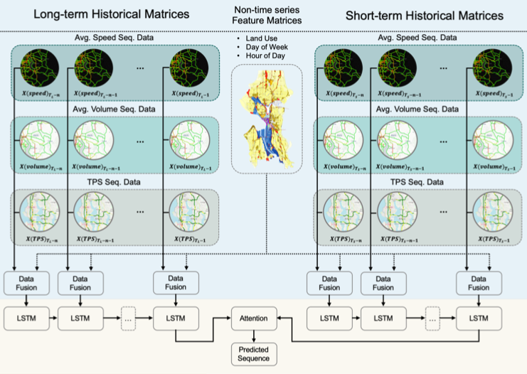
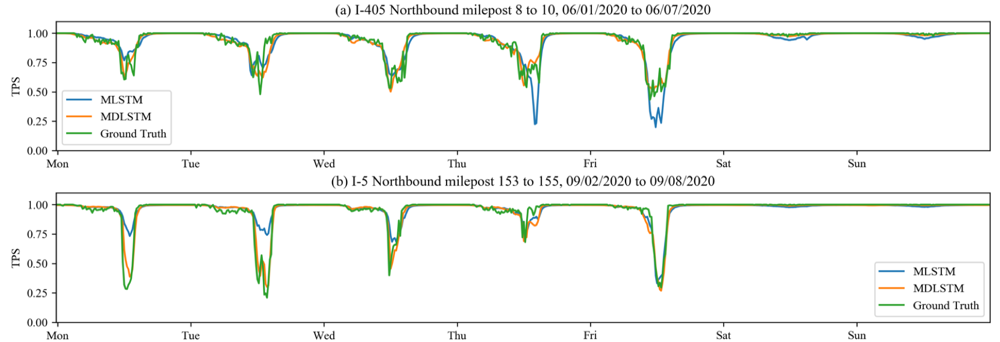

# lstm_dual_lstm

During the coronavirus pandemic, traffic patterns changes continuously based on work-form-home policy and state regulations. The unsteadiness of social circumstances makes traffic forecasting a difficult task to reflect the status quo. This repo includes a multivariate dual LSTM architecture to accommodate interference and incidents in recurrence data.

This repo used the Traffic Performance Score (TPS) provided by [STAR Lab TPS](http://tps.uwstarlab.org/) to evaluate the developed framework. Below shows the forcasting results with and without the dual LSTM structure and the predictions with the structure better align to the ground truth data.

